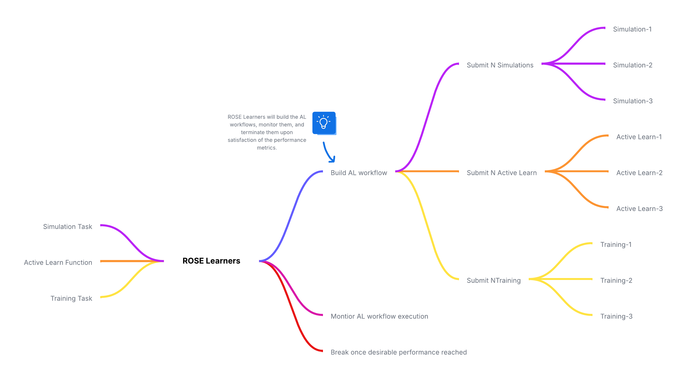

## What is ROSE? 🌹

ROSE: RADICAL Orchestrator for Surrogate Exploration (ROSE) toolkit is a framework designed to enable the concurrent and adaptive execution of simulation, surrogate training, and selection tasks on High-Performance Computing (HPC) resources. ROSE is a Python package that provides tools for developing active and reinforcement learning (AL and RL) methods for scientific applications. It enables users to define simulation and surrogate training tasks and automatically manage their execution on HPC resources via a predefined set of Learning Policies (Learners).

ROSE also includes tools to facilitate the selection of the most effective surrogate model for a given simulation based on performance metrics.

ROSE leverages [**RADICAL-Cybertools**](https://radical-cybertools.github.io), a set of middleware building blocks that simplify the development of sophisticated scientific workflows on HPC resources.

## Why ROSE? 🚀🚀🚀
ROSE allows you to enable, scale, and accelerate your learning workflows across thousands of CPU cores and GPUs effectively and efficiently with just a few lines of code.
ROSE is built on the [**RADICAL-AsyncFlow**](https://radical-cybertools.github.io/radical.asyncflow/) and [**RADICAL-Pilot**](https://github.com/radical-cybertools/radical.pilot) runtime system, a powerful execution engine that enables the distributed execution of millions of scientific tasks and applications such as executables, functions and containers effortlessly.

<figure markdown="span" style="position: relative;">
  
  <figcaption>ROSE Mind Map and Flow Diagram</figcaption>
</figure>

## Key Features ⭐⭐⭐

- **Express, build and run** different Active Learn workflows in minutes.
- **Seamless Execution of Complex Active Learning Workflows** across diverse computing platforms:
    - Local desktops and laptops
    - Local and remote clusters and grids
    - Leadership-class HPC platforms

- **Asynchronous, Flexible Workflow Management** capabilities

- **Pythonic API** providing a clean separation between the learning workflow components:
    - Simulation
    - Training
    - Conditional ML metrics
    - Multiple out of the box learning policies (learners)

- **Heterogeneous Task Execution** on GPUs, CPUs, with MPI and/or sequential tasks.

<figure markdown="span" style="position: relative; left: 600px; top: -160px">
  
  <figcaption>NSF Funded Project (#2212550)</figcaption>
</figure>
