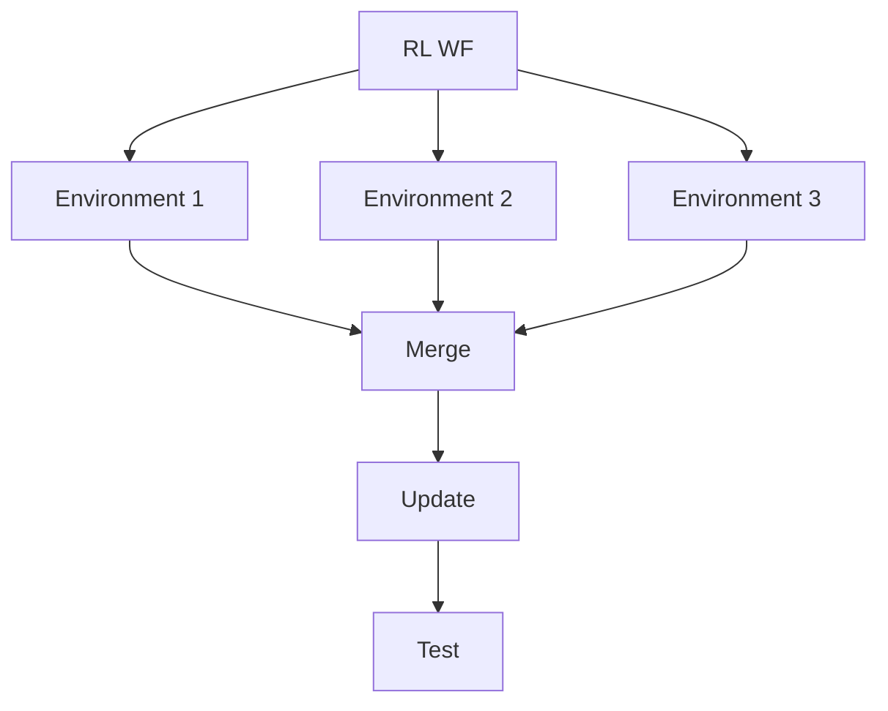

# Advanced Reinforcement Learning Workflow

In addition to basic reinforcement learning (RL) workflows, ROSE supports advanced RL workflows that can run multiple environment instances in parallel.

The 'ParallelLearner' gives you the ability to run multiple environment tasks simultaneously, each with different parameters, and then merge their experiences for training.

This is particularly useful for scenarios where you want to explore different configurations or hyperparameters in parallel, speeding up the learning process.

Import ROSE parallel RL modules:

```python
from radical.asyncflow import WorkflowEngine
from rhapsody.backends import DragonExecutionBackendV3
from rose.rl import SequentialReinforcementLearner
```


`ParallelExperience` is able to run multiple environment instances simultaneously, each with different exploration parameters:

```python

async def main():

    execution_engine = await DragonExecutionBackendV3()

    asyncflow = await WorkflowEngine.create(execution_engine)

    pe = ParallelExperience(asyncflow)

    code_path = f'{sys.executable} {os.getcwd()}'

    # Define multiple environment tasks
    @pe.environment_task(name='env_1')
    async def environment_1(*args):
        return f'{code_path}/environment.py parameter=1'

    @pe.environment_task(name='env_2')
    async def environment_2(*args):
        return f'{code_path}/environment.py parameter=2'

    @pe.environment_task(name='env_3')
    async def environment_3(*args):
        return f'{code_path}/environment.py parameter=3'

    @pe.environment_task(name='env_4')
    async def environment_4(*args):
        return f'{code_path}/environment.py parameter=4'

    @pe.environment_task(name='env_5')
    async def environment_5(*args):
        return f'{code_path}/environment.py parameter=5'
```

Now that each environment task is defined, we define the rest of the workflow components:

!!! note
    This snippet of code must be inside an async context or inside `main` function

```python
@pe.update_task
async def update(*args):
    return f'{code_path}/update.py'

@pe.as_stop_criterion(metric_name='MODEL_REWARD', threshold=200, operator=GREATER_THAN_THRESHOLD)
async def check_reward(*args):
    return f'python3 {code_path}/check_reward.py'
```

One of the key advantages of ROSE's `ParallelExperience` learner is that experience banks generated by parallel environments are automatically merged without any manual intervention. This eliminates the complexity of coordinating data aggregation across distributed environment instances.

Note that, you do not need to invoke these tasks, as the `ParallelExperience` will be responsible to manage their invocations.

```python

# Start the RL training loop and break when stop condition is met
await pe.learn()
await engine.shutdown()
```

This advanced workflow allows you to efficiently explore multiple configurations in parallel, leveraging ROSE's capabilities to manage and merge experiences seamlessly. The `ParallelExperience` learner is particularly useful for scenarios where you want to speed up the learning process by running multiple environment instances concurrently, each with different parameters or hyperparameter.
